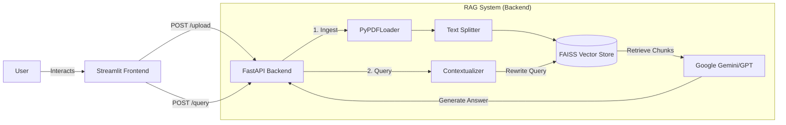

# 📚 Context-Aware PDF RAG Chatbot


A production-ready Retrieval-Augmented Generation (RAG) system that allows users to have **natural, multi-turn conversations** with PDF documents.

Unlike simple Q&A bots, this system features **Conversational Memory**. It intelligently reformulates follow-up questions (e.g., *"How much does **it** cost?"*) into standalone queries before searching the vector database, ensuring high retrieval accuracy.

## 🚀 Key Features

* **🧠 Conversational Memory** — Uses a "Condense Question" chain to handle follow-up questions and maintain context across turns.
* **🏗️ Hybrid Architecture** — Decoupled **FastAPI** backend for processing and **Streamlit** frontend for user interaction.
* **🔍 Advanced Retrieval** — Uses **FAISS** for fast similarity search and `HuggingFaceEmbeddings` (all-MiniLM-L6-v2) for high-quality vectors.
* **📄 Robust Ingestion** — Chunks documents intelligently (1000 chars, 200 overlap) to preserve context across boundaries.
* **🤖 Multi-LLM Support** — Configured for **Google Gemini 2.5 Flash** (default) with fallback support for OpenAI GPT models.
* **🐳 Dockerized** — Ready for deployment on Hugging Face Spaces or any container runtime.

## 🛠️ Tech Stack

| Component | Technology |
|-----------|------------|
| Backend API | [FastAPI](https://fastapi.tiangolo.com/) |
| Frontend UI | [Streamlit](https://streamlit.io/) |
| RAG Orchestration | [LangChain](https://www.langchain.com/) |
| Vector Store | [FAISS](https://github.com/facebookresearch/faiss) |
| Embeddings | [HuggingFace Sentence Transformers](https://www.sbert.net/) |
| LLM (Primary) | [Google Gemini](https://ai.google.dev/) |
| LLM (Fallback) | [OpenAI GPT](https://openai.com/) |
| PDF Parsing | [pypdf](https://pypdf.readthedocs.io/) |
| Containerization | [Docker](https://www.docker.com/) |

## 🏗️ Architecture

The system consists of two main services running in parallel:



## 📦 Project Structure

```
pdf-rag-chatbot/
├── app/
│   ├── api.py             # FastAPI endpoints (/upload, /query)
│   ├── rag.py             # Core RAG logic (embeddings, FAISS, chains)
│   └── ui.py              # Streamlit chat interface
├── docs/
│   ├── api.md             # API reference
│   ├── architecture.md    # Architecture deep dive
│   ├── development.md     # Development guide
│   └── setup.md           # Installation & setup
├── tests/
│   ├── test_api.py        # API endpoint tests
│   └── test_rag.py        # RAG system unit tests
├── .github/
│   ├── workflows/ci.yml   # CI pipeline
│   ├── ISSUE_TEMPLATE/    # Bug report & feature request templates
│   └── pull_request_template.md
├── .env.example           # Environment variable template
├── .gitignore             # Git ignore rules
├── CHANGELOG.md           # Version history
├── CONTRIBUTING.md        # Contribution guidelines
├── Dockerfile             # Container configuration
├── LICENSE                # MIT License
├── README.md              # This file
└── requirements.txt       # Python dependencies (pinned)
```

## ⚡ Installation & Setup

### Prerequisites

* Python 3.9+
* An API key for **Google Gemini** or **OpenAI**

### 1. Clone the Repository

```bash
git clone https://github.com/mnoumanhanif/pdf-rag-chatbot.git
cd pdf-rag-chatbot
```

### 2. Create a Virtual Environment

```bash
python -m venv .venv
source .venv/bin/activate  # On Windows: .venv\Scripts\activate
```

### 3. Install Dependencies

```bash
pip install -r requirements.txt
```

### 4. Configure Environment

```bash
cp .env.example .env
```

Edit `.env` and add your API key:

```env
# Required: Choose one or both
GOOGLE_API_KEY=your_google_api_key_here
OPENAI_API_KEY=your_openai_api_key_here
```

### 5. Run Locally

You need two terminals — one for the backend and one for the frontend.

**Terminal 1 (Backend):**

```bash
uvicorn app.api:app --reload --port 8000
```

**Terminal 2 (Frontend):**

```bash
streamlit run app/ui.py
```

Open `http://localhost:8501` to use the chat interface.

## 🐳 Docker

Build and run using Docker:

```bash
docker build -t pdf-rag-chatbot .
docker run -p 8000:8000 -p 8501:8501 --env-file .env pdf-rag-chatbot
```

## 💬 Usage

1. **Upload PDFs** — Use the sidebar to upload one or more PDF documents
2. **Ask Questions** — Type a question in the chat input about your documents
3. **Follow Up** — Ask follow-up questions naturally; the system maintains conversation context

## 🧪 Testing

```bash
pip install pytest
pytest tests/ -v
```

## 📖 Documentation

| Document | Description |
|----------|-------------|
| [docs/setup.md](docs/setup.md) | Installation & configuration |
| [docs/architecture.md](docs/architecture.md) | System architecture |
| [docs/development.md](docs/development.md) | Development workflow |
| [docs/api.md](docs/api.md) | API reference |

## 🤝 Contributing

Contributions are welcome! Please see [CONTRIBUTING.md](CONTRIBUTING.md) for guidelines.

## 📄 License

This project is licensed under the MIT License. See [LICENSE](LICENSE) for details.

## 👤 Author

**Nouman Hanif** — [@mnoumanhanif](https://github.com/mnoumanhanif)

### 📹 Related Tutorial

Deploying a Full-Stack RAG App to Hugging Face Spaces (FastAPI + Streamlit) 👉 [Click Here - TechData 360](https://youtu.be/S68ae5wbDuo)
